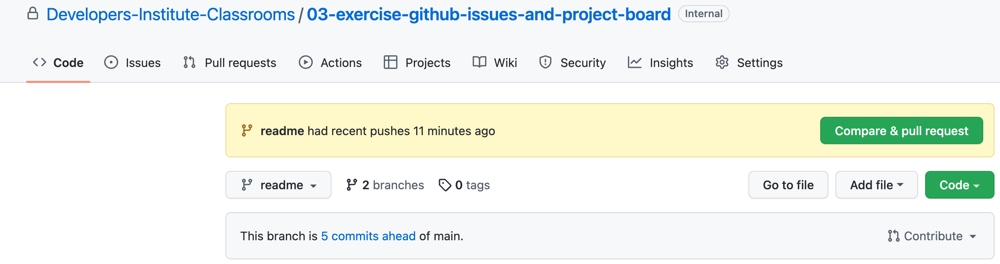
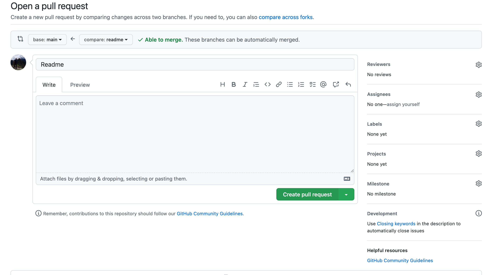
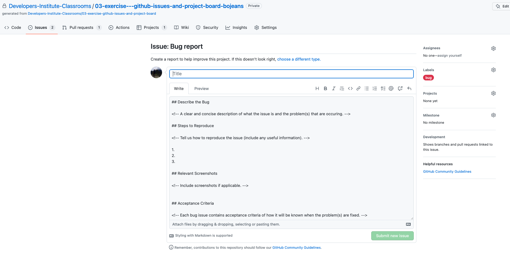

# 03-exercise-github-issues-and-project-board
This exercise will focus on creating GitHub Issues and Project Boards. We will also look at creating a branch, creating & merging a pull request and how to communicate with our teaching team via github.  

---

## Getting Started
Read and complete the below steps in order for this exercise. You will only need to clone and open this repository in VScode for Part C. It is essentially a blank repo so you may choose to complete this exercise solely in the browser if you want. 

---
## Part A - Create a Project Board
Follow along to the [GitHub docs](https://docs.github.com/en/issues/planning-and-tracking-with-projects/creating-projects/creating-a-project) for creating a project board and/or follow along to the [loom walkthrough](https://www.loom.com/share/67f24f6ab63a403fa139a9318b53b558) provided. 
### Acceptance criteria
 A GitHub Project board is used to visualize your work.

 ---

## Part B - Create GitHub Issues
Follow along to the [GitHub docs](https://docs.github.com/en/issues/tracking-your-work-with-issues/quickstart) for creating a GitHub issue and/or follow along to the [loom walkthrough](https://www.loom.com/share/9184aeb28e9143009cc09d763a536d68) provided. Feel free to come up with your own scenario for the project board, it does not have to be coding specific for this exercise.

Here are some user story examples you could choose to create GitHub issues for if you're struggling for ideas:

**User Story example 1**

- **As a** junior developer
- **I want to** create a website portfolio
- **So that** I can showcase my skills and apply for jobs. 

**User Story example 2**

- **As a** travel junkie
- **I want to** plan a trip overseas
- **So that** I can relax and have a holiday

 **Note:** The terms `issues` or `GitHub issues` can be confusing at first as you might be associating this with a problem/error. You should think of GitHub issues as a way of tracking your work. This can range from todo tasks, ideas, bugs, feedback. 

### Acceptance criteria
- Each GitHub Issue contains an appropriate [acceptance criteria](https://nomad8.com/articles/on-acceptance-criteria-for-user-stories).
- It is recommended that you practice the [GIVEN/WHEN/THEN](https://martinfowler.com/bliki/GivenWhenThen.html) format for writing your acceptance criteria.
- A minimum of 3 GitHub issues have been created.   


## Part C - Development Process 
The purpose of this section is to create a branch and learn how to do a Pull Request (PR) and request a review.

  If you chose a coding related user story, you're more than welcome to go above and beyond if you want to work on implementing your user story or creating more GitHub issues. For this exercise there is no expectation to implement any of the GitHub issues you have created.

## Instructions
- create a separate branch. ```git checkout -b myBranch``` replace myBranch with what ever you want your branch to be called.     
- make a change to the text file creatively named `changeMe.txt`
- commit and push to github. **NOTE** you might receive a message in the terminal regarding no upstream branch. Copy & Paste the example when you push. ```git push --set-upstream origin myBranch```
- Go back to your browser and your GitHub should show the option to `Compare & pull request` click that big green button  
- You will then see the following screen. Don't forget to leave a comment describing your changes.
### **IMPORTANT -** If you require help during exercises/projects this semester you should use the @ mention in your PR comment and/or follow the asking for help process. Eg @bob - I can't get my server test to pass, any hints. Please don't do this if you don't require help.  

- Take note of the menu on the right in the above screenshot: 

**Reviewers -** this is where you add your teaching team

**Assignees -** you can assign yourself or leave this blank. Mainly a feature for team projects.

**Labels -** optional, can helpful when requesting help or reporting a bug. 

**Projects -** this is where you add your project board that you created in Part A

**Milestone -** disregard this one. 
  

## Acceptance criteria
- A separate branch is created and pushed to GitHub
- A pull request has been created and merged into the main branch on github. 
- Pull requests include a description explaining the changes made and have the tech lead and teaching assistant(s) added as reviewers.
- Pull requests have comments added to ask for help/feedback, if needed. A clear description of any issues is provided.

## Walkthroughs
[Part C via VScode](https://www.loom.com/share/c63a4313a7de47148e3b47a9c4f05170)  
[Part C via GitHub in the broswer](https://www.loom.com/share/f17fc29d13e849d88ae7ac6edcff7a3d)


## Part D - Bug reporting (optional) 
This part is optional as it isn't really applicable for this exercise. Either way have a quick [read of this](https://everhour.com/blog/best-bug-tracker-software/#GitHub). For this part you would essentially replicate Part B but instead of selecting add task you would select ```Bug report``` You should then see the following screen and this will create a GitHub issue with the bug label on it. 

If you want to do this then pretend there is a bug in your repository, for example: prettier is failing the autograding, or you have an eslint error for an unused javascript variable. 

**Acceptance criteria**

1. A Bug Report is raised via GitHub Issues. You can raise more than 1 if you want to. 
2. Each bug issue contains a detailed description of the problems that are occurring.
3. Each bug issue contains acceptance criteria of how it will be known when the problems are fixed.
4. The problems have been fixed and the bug GitHub Issue has been closed.

## Walkthrough
[Part A, B, D GitHub Project Board, issues and bug report example](https://www.loom.com/share/50fa6a6521c5409584108ed95efcc369)

# Submit your Exercise

- [ ] Commits are pushed to GitHub
- [ ] Exercise is submitted in Google Classroom